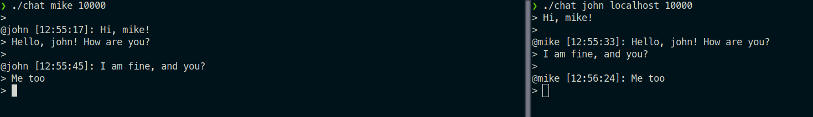

### Grpc peer-to-peer char

Задание с практики Выполнили Зеленцова Ирина и Корнаухов Михаил

Был имплементирован чат с использованием языка Go и технологии grpc
Один пользователь является сервером, а второй клиентом, и после установления канала они могут обмениваться сообщениями. 

