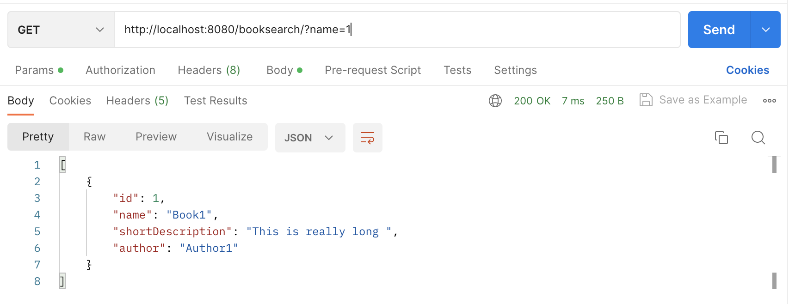
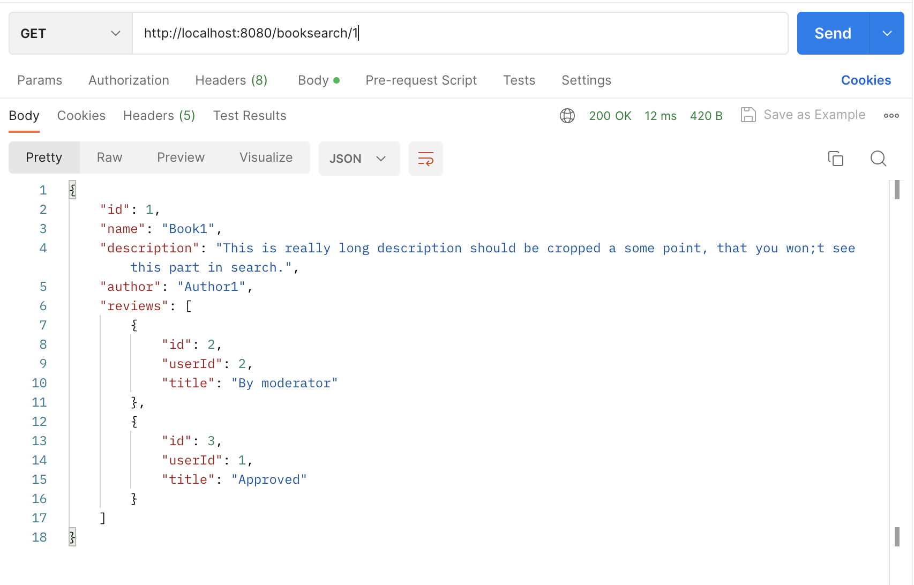
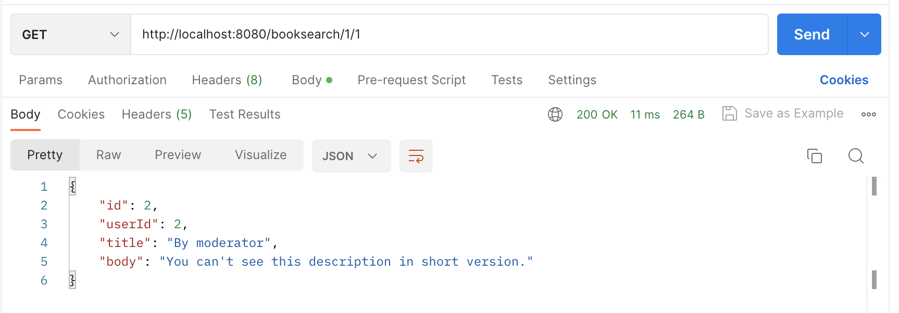
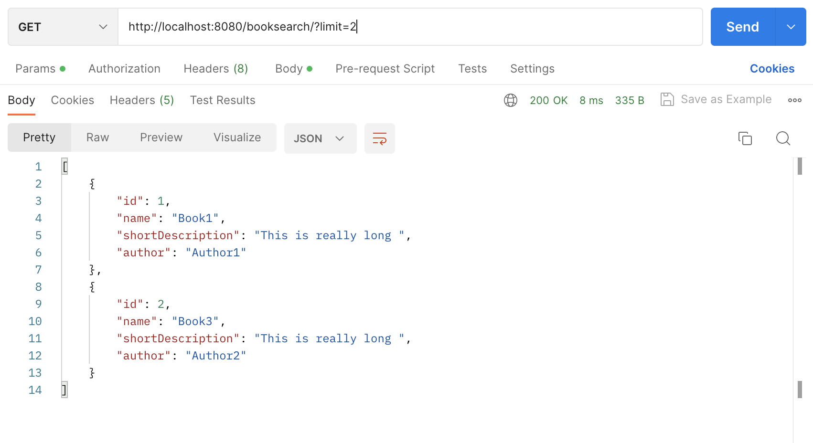

### Book Store REST Service

Задание с практики Выполнили Зеленцова Ирина и Корнаухов Михаил

endpoints:

*booksearch/?name=<book_name>&author=<author_name>*
All parameters are optional.
Also can be set limit(default 10) and offset(default 0).
Return list of book views for search

*booksearch/{id}*
Return full book view with approved reviews and reviews from moderator

*booksearch/{id}/{review_id}*
Return Full Review

Examples

PS: безопасность ни к черту, но работает

