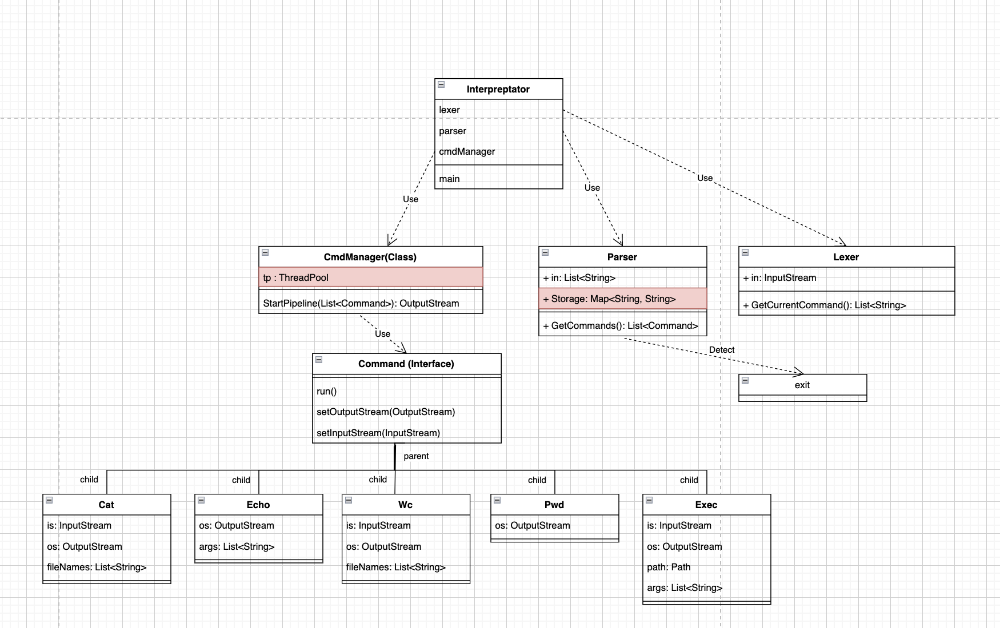

# CLI

## Взаимосвязь классов-команд
Есть интерфейс **Command**, наследуемый от интерфеса Runnable, от которого наследуется все доступные команды в интерпретаторе. Каждая команда при наследовании имеет метод run() для непосредственно запуска. Так же каждый класс-наследник при необходимости имеет PipeInputStream и/или PipeOutputStream и обрабатывает соответствующим образом. 

## Структура workflow

Основной класс **Interpretator**, внутри которого хранится **Lexer**, **Parser** и **CmdManager**. 
**Interpretator** является связующим элементом для всех остальных классов и отвечает за получение данных на вход и передачу их в **Lexer**. Затем передачу полученных данных в **Parser**, от туда передачу в **CmdManager** и выведение полученного результата в консоль. 
**Lexer** отвечает за разбиение строки на токены. 
**Parser**  отвечает за преобразование токенов в список команд, сохранение переменных в окружение и их подстановку в команды. Также на данном этапе происходит детектирование команды exit. 
**CmdManager** отвечает за создание и запуск полученных команд из **Parser** в Thread Pool, а так же связывает **Commands** между собой с помощью Pipe в необходимом порядке. Детектируя завершение работы последней команды из pipe возвращает в **Interpretator**. 
 

## 1 фаза разработки
Реализация основных классов-команд, которые наследуется от Command и основной логики приложения, без Thread Pool в **CmdManager** и HashMap в **Parser**.

## 2 фаза разработки
Добавление Thread Pool в **CmdManager** для поддержки pipe и HashMap в **Parser** для поддержки переменных окружения. На схеме выделены красным.